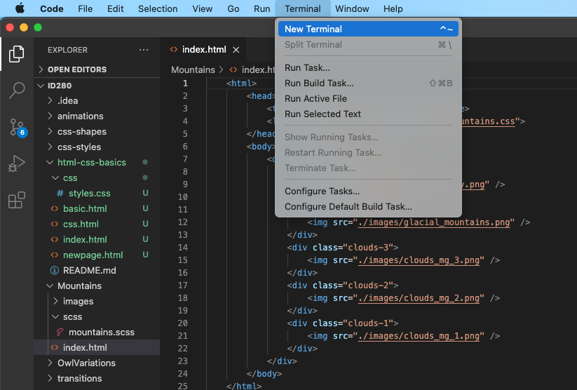
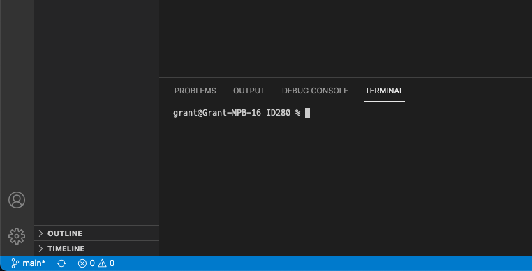
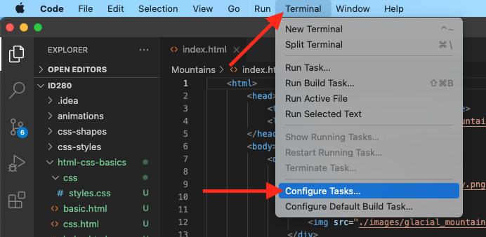
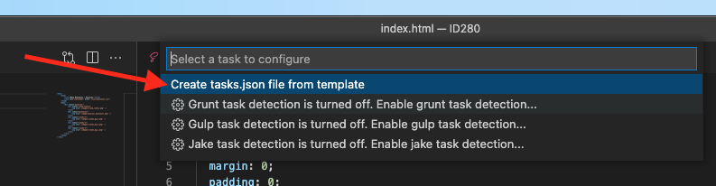
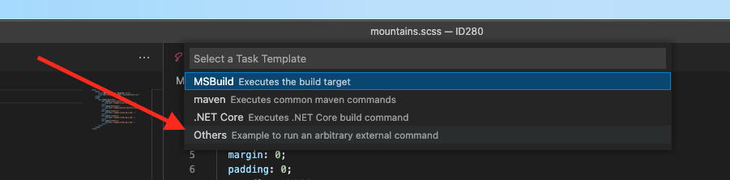
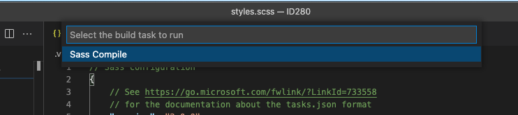
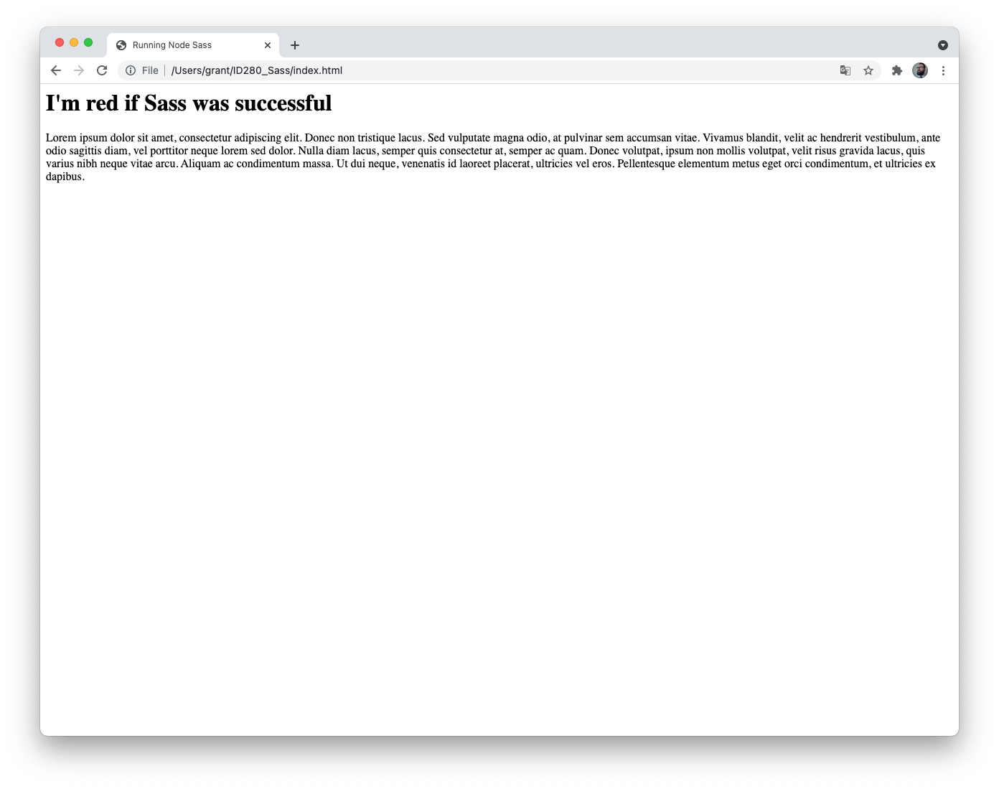
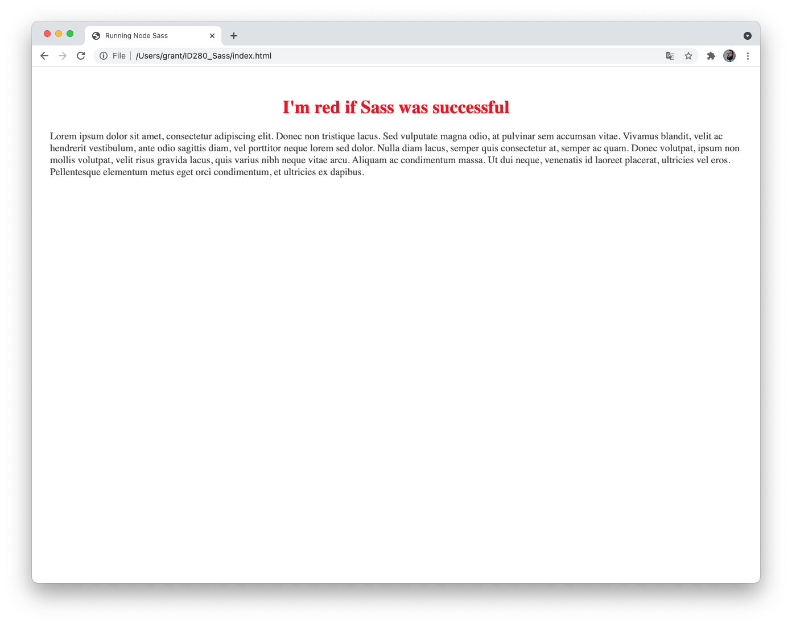

# Setting up Sass (SCSS) Transpiling in Visual Studio Code

This is a simplified version of the instructions found in the [VS Code - CSS Docs](https://code.visualstudio.com/docs/languages/css)

## Transpiling Sass and Less into CSS
VS Code can integrate with a Sass transpiler through our integrated [task runner](https://code.visualstudio.com/docs/editor/tasks). We can use this to transpile `.scss` files into `.css` files.

### Step 1: Install a Sass transpiler
For this walkthrough, let's use the [node-sass](https://www.npmjs.com/package/node-sass) Node.js module.

> Note: If you don't have Node.js and the npm package manager already installed, you'll need to do so for this walkthrough. [Install Node.js](https://nodejs.org/en/download/) for your platform. The Node Package Manager (npm) is included in the Node.js distribution. You'll need to open a new terminal (command prompt) for `npm` to be on your PATH.
From within VS Code, select the terminal menu and select "New Terminal".


 
This opens the Command Line window at the bottom of the screen.



In the terminal window, paste the following then hit return.
```javascript
npm install -g node-sass
```

This installs the node-sass package on your computer and it will be accessible for any project going forward.

### Troubleshooting Errors - MacOS
If you have a permissions error installing `node-sass` you will need to update your permissions for the `node_modules` folder.

In the terminal enter the following, one command at a time, replacing "USERNAME" with your username.

```
cd /usr/local/lib;
sudo chown -R USERNAME node_modules
npm install -g node-sass
```


### Step 2: Create a simple Sass file

> For this repo the `styles.scss` file has already been created

Open VS Code on an empty folder and create a styles.scss file. Place the following code in that file:

```scss
body {
  padding: 0;
  margin: 0;
  font-size: 16px;

  > * {
    box-sizing: border-box;
  }

  .main-content {
    padding: 2em;

    h1 {
      font-size: 2em;
      color: red;
      text-align: center;
    }

    p {
      color: #444;
      font-size: 1.1em;
      line-height: 1.2em;
    }
  }
}
```

### Step 3: Create tasks.json
The next step is to set up the task configuration. To do this, run **Terminal > Configure Tasks**



Then click **Create tasks.json file from templates**.



In the selection dialog that shows up, select **Others**.



This will create a sample tasks.json file in the workspace .vscode folder. The initial version of the file has an example to run an arbitrary command. We will replace that configuration with the following code to transpile Sass instead. Copy the code and paste it into the file then save.

```javascript
// Sass configuration
{
    // See https://go.microsoft.com/fwlink/?LinkId=733558
    // for the documentation about the tasks.json format
    "version": "2.0.0",
    "tasks": [
        {
            "label": "Sass Compile",
            "type": "shell",
            "command": "node-sass styles.scss styles.css",
            "group": "build"
        }
    ]
}
```

### Step 4: Run the Build Task
As this is the only command in the file, you can execute it by pressing `⇧⌘B` (Run Build Task).

If the command asks which build task to run, select **Sass Compile**.



The sample Sass file should not have any compile problems, so by running the task all that happens is a corresponding `styles.css` file is created.


### Troubleshooting Errors - Windows 10
Windows Users, if you have an error running the task

```
node-sass : File C:\Users\[username]\AppData\Roaming\npm\node-sass.ps1cannot be loaded because running scripts is 
disabled on this system. For more information, see about_Execution_Policies at 
https:/go.microsoft.com/fwlink/?LinkID=135170.
```
You will need to update your script execution permissions.

Open Powershell and paste this command:

```
Set-ExecutionPolicy Unrestricted -Scope CurrentUser
```

When prompted, enter A, for Yes to All, and hit return

```The execution policy helps protect you from scripts that you do not trust. Changing the execution policy might expose
you to the security risks described in the about_Execution_Policies help topic at
https:/go.microsoft.com/fwlink/?LinkID=135170. Do you want to change the execution policy?
[Y] Yes  [A] Yes to All  [N] No  [L] No to All  [S] Suspend  [?] Help (default is "N"): 
```

Return to Visual Studio Code and run the command again.


## Testing

Once you run the build task open the index.html file in a browser. If your build was successful you will see a styled page.

### Unstyled




### Success!!




